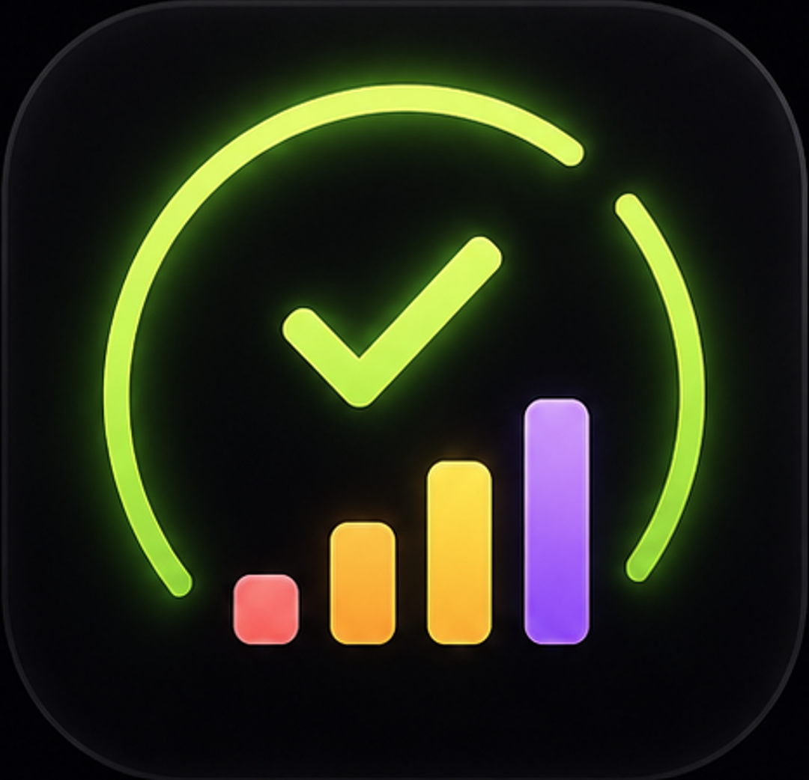

# Habit Tracker - Habito

A local-first mobile habit tracking app built with **Expo React Native** and **TypeScript**. The app helps users build routines, track progress across days, manage flexible habit schedules, and review consistency through visual stats and heatmaps.

## Overview

Habit Tracker is designed as an offline-first personal productivity app. Users can create habits, customize how and when they appear, complete or skip them for specific dates, and view progress through a polished dark neon interface.

The app currently runs in **Expo Go** for development and is structured to support future EAS builds for iOS and Android.

## Features

- **Local-first habit tracking** using SQLite
- **Create, edit, archive, and restore habits**
- **Custom habit icons and emoji picker**
- **Habit descriptions, colors, and live preview cards**
- **Flexible schedules**
  - Daily habits
  - Specific weekdays
  - Every X days / interval-based habits
- **Selected-date tracking**
  - Scroll through dates
  - Mark habits complete for past dates
  - Prevent completion of future dates
- **Skip habits with required reasons**
  - Skipped days are tracked separately from missed days
- **Subtasks and goal-based habits**
  - Checklist-style subtasks
  - Numeric goals such as pages, liters, minutes, etc.
- **Dark neon UI design** with rounded cards and custom habit boxes
- **Build the Day dashboard** with progress summary
- **Stats tab** with weekly, monthly, and yearly views
- **GitHub-style completion heatmaps**
- **Habit detail pages** with streaks, history, and progress
- **Local reminder notifications**
- **Settings screen** with data export, import, and reset
- **Offline support** with no account or cloud sync required

## Tech Stack

- **Expo React Native**
- **TypeScript**
- **Expo Router**
- **SQLite** via `expo-sqlite`
- **Expo Notifications**
- **date-fns**
- **Local-first architecture**

## Project Status

This project is currently in active development. The core habit tracking experience is functional, including scheduling, completion tracking, skips, subtasks, numeric goals, stats, reminders, and local data management.

Current development/testing is done through **Expo Go**. A future version may use **EAS Build** for native iOS/Android testing, TestFlight, and App Store deployment.

## Getting Started

Install dependencies:

```bash
npm install
```

Start the Expo development server:

```bash
npx expo start
```

Then open the app in **Expo Go** on your phone.

Run checks:

```bash
npm run lint
npx tsc --noEmit
```

## Notes

The app is intentionally local-first. Habit data is stored on the device unless the user manually exports it. Cloud sync, accounts, widgets, and app store distribution are planned as possible future improvements, but are not part of the current MVP.

## License

This project is currently private/personal. Add a license before publishing or accepting contributions.
